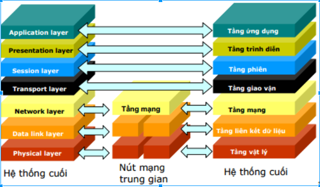
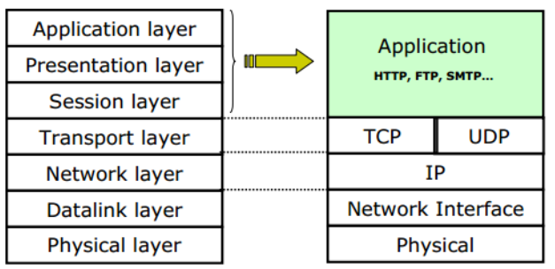
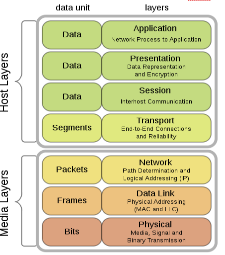
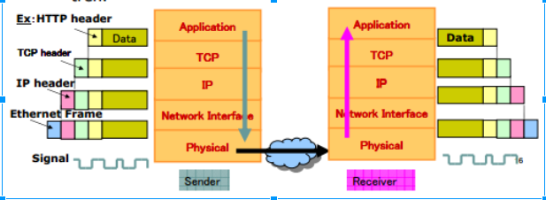

# **TÌM HIỂU CƠ BẢN VỀ NETWORKING**
## **Khái niệm:** Mạng máy tính là tập hợp các máy tính kết nối với nhau dựa trên một kiến trúc nào đó để trao đổi dữ liệu. VD: mạng Internet, mang Ethernet, mạng Lan, mạng không dây….
*	Giúp nhiều người có thể dùng chung 1 phần mềm tiện ích.
*	Chia sẻ tài nguyên với nhau 1 cách dễ dàng.
*	Kết nối với các thành phần, thiết bị khác mà không cần kết nối thủ công.

## **Mô hình xử lý:**
*	Mô hình tập trung (Centralized computing) là toàn bộ các tiến trình xử lý diễn ra ở máy tính trung tâm. Còn các máy khác sẽ kết nối với máy tính trung tâm đóng vai trò như nới nhập xuất dữ liệu.
**	Ưu điểm: Dễ bảo mật an toàn, dễ sao lưu, dễ diệt virus và chi phí cài đặt thấp vì mọi xử lý hay dữ liệu đều tập trung ở máy  tính trung tâm.
**	Nhược điểm: Khó đáp ứng được yêu cầu của nhiều ứng dụng, tốc độ truy xuất chậm.
*	Mô hình phân tán (Distributed computing): các máy tính có khả năng hoạt động độc lập, các công việc được tách nhỏ và giao cho nhiều máy tính khác nhau trong mạng thay vì tập trung ở 1 máy tính như mô hình tập trung. Dữ liệu được xử lý cục bộ nhưng có kết nối mạng với nau nên có thể trao đổi dữ liệu và dịch vụ.
**	Ưu điểm: Truy xuất nhanh, không giới hạn các ưng dụng và chức năng.
**	Khuyết điểm: Dữ liệu lưu trữ ở nhiều máy khó đồng bộ và sao lưu, rất dễ nhiễm virus.
*	Mô hình cộng tác (Collaborative computing): mô hình gồm nhiều máy tính có thể hợp tác để thực hiện một công việc. Một máy tính có thể mượn năng lực tính toán xử lý của máy tính khác bằng cách chay các chương trình trên các  máy tính nằm trong mạng.
**	Ưu điểm: Xử lý nhanh và manh, có thể dùng để chạy các ứng dụng đòi hỏi tốc độ xử lý lớn.
**	Khuyết điểm: giống như mô hình phân tán là dữ liệu khó đồng bộ và sao lưu, khả năng nhiễm virus rất cao.

## ** Kiến trúc mạng: ** bao gồm hình trạng(topology) và giao thức (protocol).
*	Hình trạng (topology):
**	Trục(Bus): dùng một kênh chung để truyền dữ liệu, mỗi máy tính và các thiết bị đầu cuối sẽ được gắn vào đó, mô hình hoạt động theo các liên kết Point-to-Multipoint or Broadcast (quảng bá đến các nút con or nút ngang hàng).
***	Ưu điểm: Dễ thiết kế và chi phí thấp
***	Khuyết điểm: tính ổn định kém, 1 nút bị hỏng thì toàn bộ mạng bị ngừng

**	Vòng(Ring): tín hiệu được truyền đi trên vòng theo một chiều duy nhất. Mỗi trạm của mạng được nối với nhau qua một bộ chuyển tiếp - repeater (bộ kết nối, khuếch đại tín hiệu) có nhiệm vụ nhận tín hiệu rồi chuyển tiếp đến trạm kế tiếp trên vòng - kiểu liên kết point to point giữa các repeater.
***	Ưu điểm: thiết lập đơn giản, dễ dàng cấu hình, dễ dàng kiểm soát và khắc phục sự cố, tận dụng được tối đa tốc độ đường truyền vật lý.
***	Khuyết điểm: một trạm hoặc cáp hỏng có thể khiến toàn bộ mạng bị ngừng hoạt động, giao thức truy cập phức tạp.
**	Sao(Star): gồm 1 máy tính trung tâm và các máy kết nối tới máy tính đó.
***	Ưu điểm: thiết lập đơn giản, dễ dàng cấu hình, dễ dàng kiểm soát và khắc phục sự cố, tận dụng được tối đa tốc độ đường truyền vật lý.
***	Khuyết điểm: độ dài đường truyền nối mỗi trạm với thiết bị trung tâm bị hạn chế.

*	Giao thức(protocol): Quy tắc truyền thông( Gửi-Nhận các thông tin)  định nghĩa khuân dạng dữ liệu, thông điệp. VD: TCP,UDP, IP, HTTP,....

## ** Mô hình truyền thông tin: ** bao gồm 3 giai đoạn: thiết lập kênh truyền, truyền dữ liệu và giải phóng kênh truyền.
*	Chuyển mạch dữ liệu theo kênh: khi hai trạm cần trao đổi thông tin với nhau thì giữa chúng sẽ thiết lâp một “kênh” cố định và duy trì tới lúc một bên ngắt kết nối. Dữ liệu chỉ được truyền theo con đường cố định này.
Kỹ thuật này thường được sử dụng trong các kết nối ATM(Asynchronous Transfer Mode-chế độ truyền không đồng bộ-truyền dữ liệu, âm thanh và hình ảnh số hóa) và Dial-up ISDN(Integrated Services Digital Networks-chỉ truyền dịch vụ thoại và chuyển mạch gói tốc độ thấp).
**	Ưu điểm: tốc độ truyền được đảm bảo do kênh truyền được dành riêng trong suốt quá trình giao tiếp phù hợp với những ứng dụng đòi hỏi thời gian thực như audio và video.
**	Nhược điểm: tốn thời gian để thiết lập kênh truyền, hiệu suất sử dụng đường truyền không cao vì không phải lúc nào 2 trạm cũng truyền liên tục.

*	Mạng chuyển mạch thông báo (Message Switching Network): không giống như chuyển mạch kênh, chuyển mạch thông báo không thiết lập kênh truyền mà sử dụng mỗi thông báo là một khối độc lập gồm địa chỉ nguồn và địa chỉ đích. Nó được truyền qua các trạm trong mạng cho đến khi đến được địa chỉ đích, mỗi trạm trung gian sẽ nhận và lưu trữa thông báo cho đến khi trạm kế tiếp sẵn sang để nhận. Ví dụ như dịch vụ thư điện tử (email).
**	Ưu điểm: quản lý hiệu quả, tăng hiệu quả sử dụng  lưu lượng của kênh truyền bằng cách gán thứ tự ưu tiên cho các thông báo.
**	Khuyết điểm: Không phù hợp với những ứng dụng thời gian thực và các trạm trung gian đòi hỏi bộ nhớ lớn để lưu trữ các thông báo.

*	Chuyển mạch dữ liệu theo gói: chia các thông báo thành các gói tin có kích thước thay đổi, mỗi gói bao gồm dữ liệu, địa chỉ nguồn, địa chỉ đích và thông tin về các trạm trung gian. Các gói tin đi theo nhiều đường khác nhau.
**	Ưu điểm: do việc chia nhỏ thành các gói và truyền đi theo nhiều đường khác nhau, các gói tin bị giới hạn độ dài tối đa nên các trạm trung gian có thể lưu thông báo ở bộ nhớ trong mà không phải đưa ra bộ nhớ ngoài nên có thể tận dụng, tăng hiệu quả truyền tin
**	Khuyết điểm: khó khăn trong việc tập hợp các gói tin tại nơi nhận.

*	Truyền thông hướng liên kết (thiết lập liên kết-truyền dữ liệu-hủy bỏ liên kết)  - TCP và không liên kết (chỉ truyền dữ liệu)-UDP

## ** Mô hình phân tâng OSI: **

*	Physical: điều khiển việc truyền tải các bit trên đường truyền vật lý. Nó định nghĩa các đặc tính vật lý như tín hiệu điện, trạng thái đường truyền, phương pháp mã hóa dữ liệu và các loại đầu nối được sử dụng gồm hữu tuyến ( Twisted Pair-Coaxial Cable-Fiber Optics) và vô tuyến không dây (Radio, hồng ngoại, ánh sáng)
Sử dụng các tín hiệu rời rạc, điện áp khác nhau để biểu diễn các bit 0 và 1.
*	Data link layer:  Truyền dữ liệu giữa các thành phần kết nối trong mạng bằng cách thêm một header chứa các địa chỉ phần cứng nơi nhận và địa chỉ nguồn của nó.	Bao gồm: đóng gói và địa chỉ hóa,truy cập đường truyền, đưa dữ liệu vào mạng phát hiện và sửa lỗi, kiểm suốt luồng và kiểm soát truy cập đường truyền. Dữ liệu dưới dạng các Frame.
*	Network layer:  Chọn đường, định tuyến gói tin từ nguồn đến đích. Dữ liệu dưới dạng thành nhiều gói Package.
*	Transport layer:  Xử lý việc truyền nhận dữ liệu cho các ứng dụng ( dữ liệu được chia nhỏ thành nhiều Segment bổ sung các thông tin về phương thức vận chuyển để đảm bảo tính bảo mật, tin cậy)
*	Sesion layer: đồng bộ hóa phiên làm việc, check-poit, khôi phục quá trình trao đổi.
*	Presentation layer: cho phép các ứng dụng biểu diễn dữ liệu, mã hóa, nén, chuyển đổi dữ liệu từ tâng ứng dụng về một dạng chung.
*	Application layer: Hỗ trợ các ứng dụng trên mạng, làm việc trực tiếp với người dùng: hình ảnh, văn bản, âm thanh, data….

[Nguồn tham khảo](https://www.digistar.vn/quy-trinh-truyen-goi-tin-trong-mo-hinh-osi/
)

## ** Mô hình TCP/IP: **

** Quá trình đóng gói: ** đi qua mỗi tầng thì gói tin đều được thêm 1 phần header

## ** Định danh trên Internet: **

